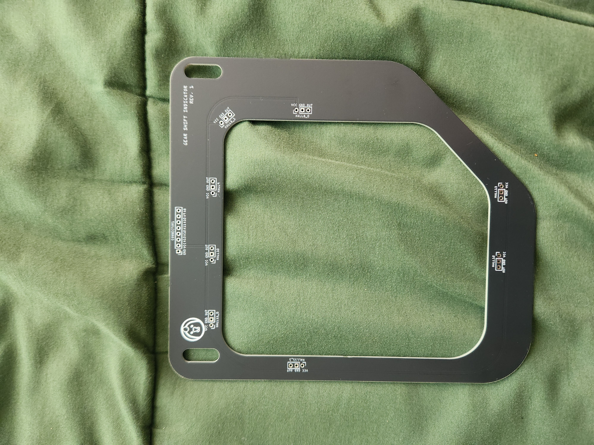
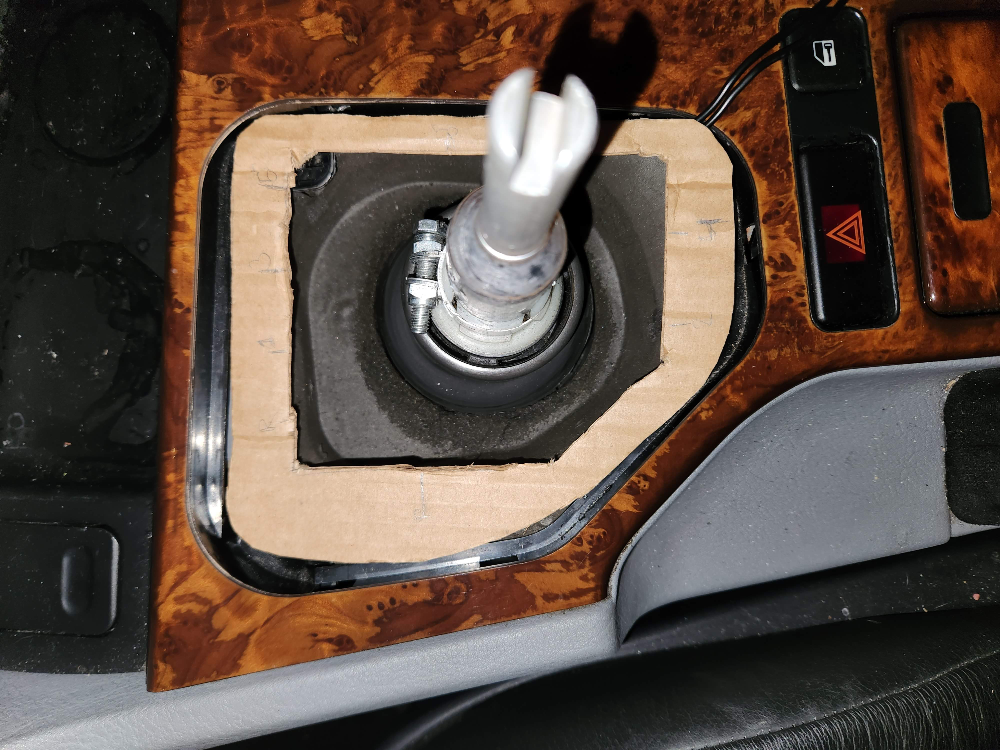
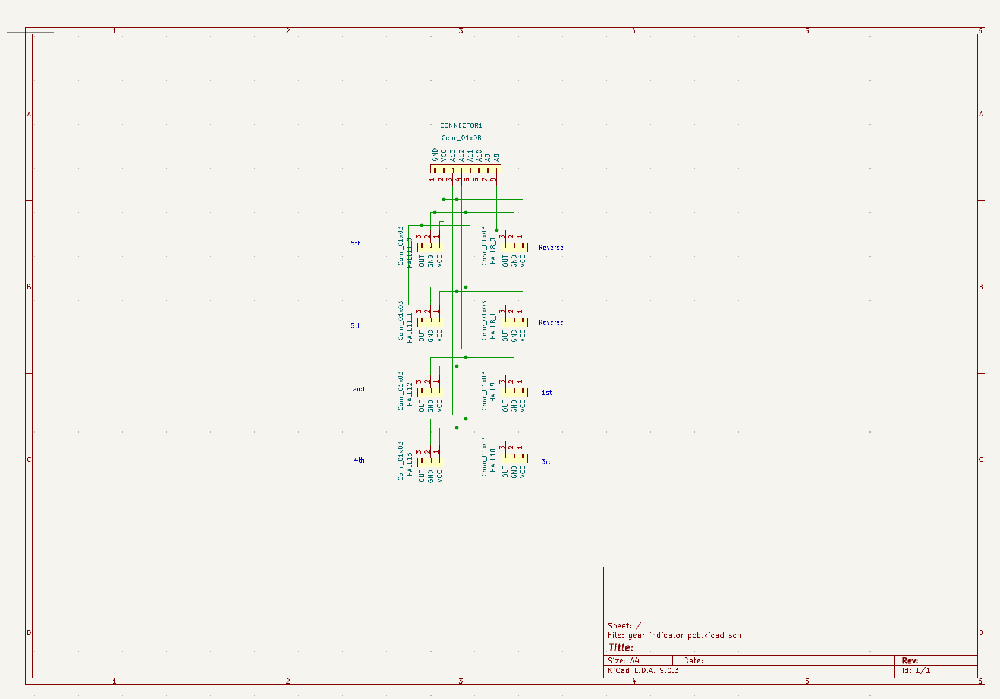
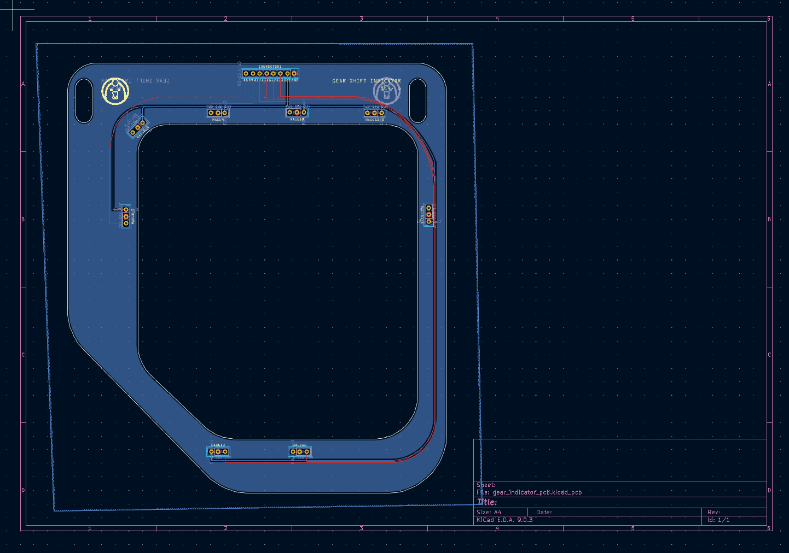
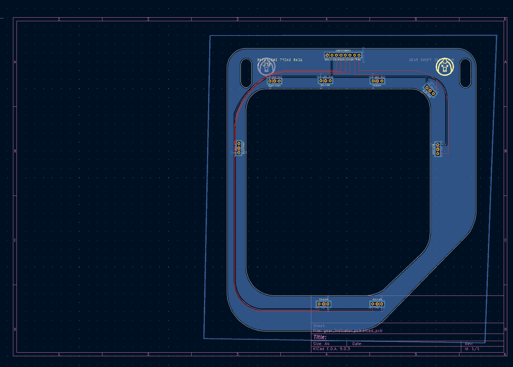
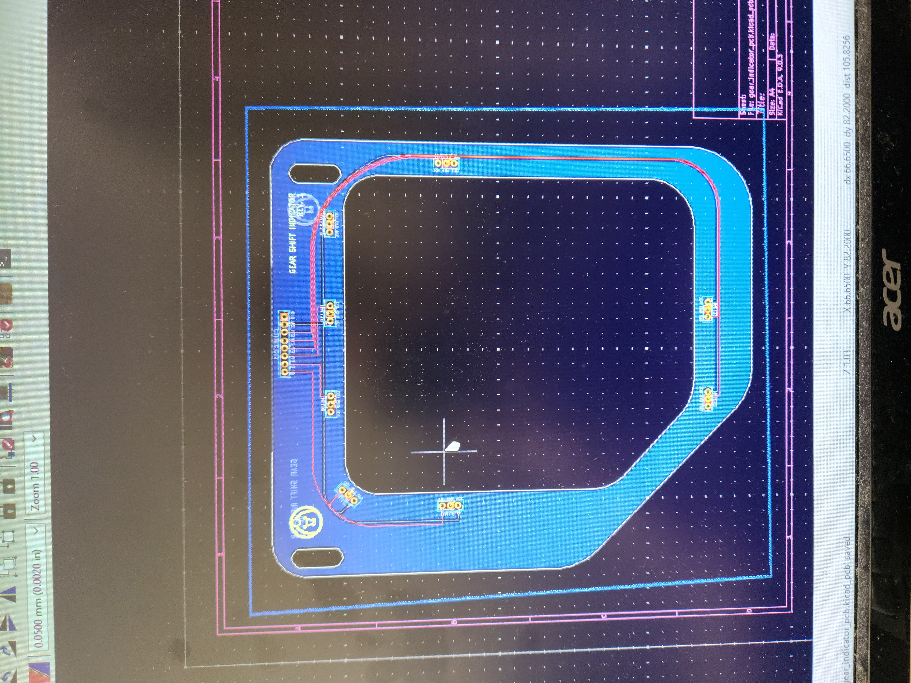
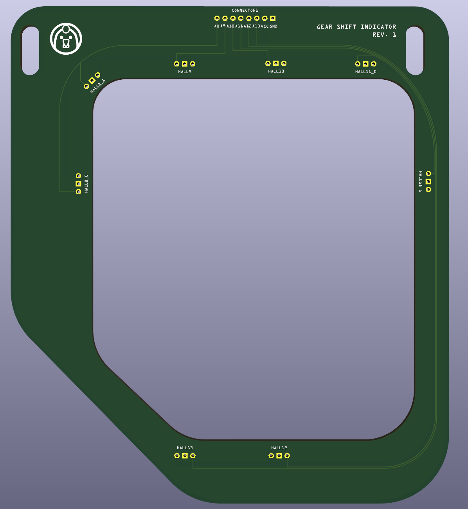
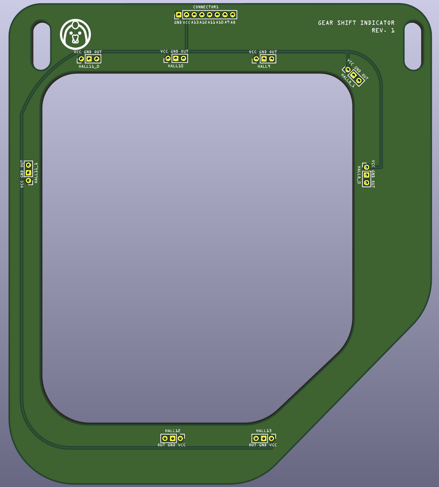
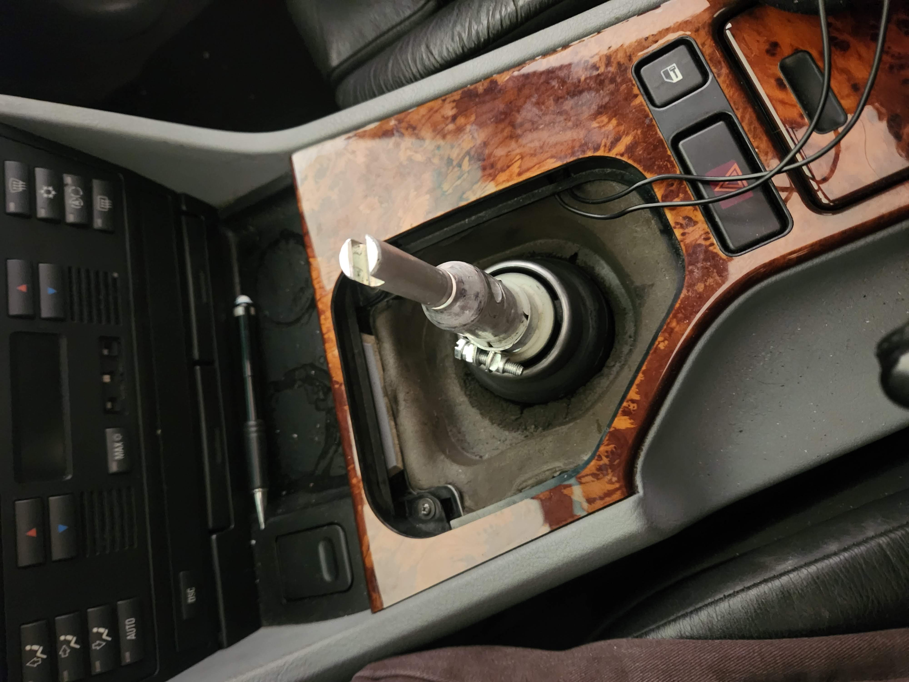

# BMW-E39-Gear-Shift-Indicator
A custom PCB gear shift indicator for the BMW E39, built from scratch — from a cardboard fitment mockup to a KiCad schematic/PCB, through JLCPCB manufacturing, to a working install in the car.

<p align="center">
  
</p>

## Table of Contents
- [1. Measuring Template with Cardboard](#1-measuring-template-with-cardboard)
- [2. KiCad Schematic & PCB](#2-kicad-schematic--pcb)
- [3. Printing from JLCPCB](#3-printing-from-jlcpcb)
- [4. Testing Assembly in Car](#4-testing-assembly-in-car)
- [5. Final Project Demo](#5-final-project-demo)
- [Repo Structure](#repo-structure)

---

## 1. Measuring Template with Cardboard

Before committing to a PCB outline, I cut a cardboard template to match the exact mounting space in the dash/console, so the final board would drop in without any fitment surprises.

<p align="center">
  
</p>

<p align="center">
  <video src="https://raw.githubusercontent.com/ChickenSoda04/BMW-E39-Gear-Shift-Indicator/main/videos/cardboard_template.mp4" controls width="600">
    Your browser does not support the video tag.
  </video>
</p>

---

## 2. KiCad Schematic & PCB

With the form factor confirmed, I designed the schematic and PCB layout in KiCad, matching the board outline to the cardboard template.

**Schematic:**
<p align="center">
  
</p>

**PCB Layout (Front / Back):**
<p align="center">
  
  
</p>

<p align="center">
  
</p>

**3D render walkthrough:**
<p align="center">
  <video src="https://raw.githubusercontent.com/ChickenSoda04/BMW-E39-Gear-Shift-Indicator/main/videos/final_kicad_pcb.mp4" controls width="600">
    Your browser does not support the video tag.
  </video>
</p>

All CAD source files (schematic, PCB, project, and Gerbers) are in [`gear_indicator_cad_files/`](gear_indicator_cad_files).

---

## 3. Printing from JLCPCB

Once the design was finalized, the Gerber files were sent to JLCPCB for manufacturing.

<p align="center">
  
  
</p>

<p align="center">
  <video src="https://raw.githubusercontent.com/ChickenSoda04/BMW-E39-Gear-Shift-Indicator/main/videos/printed_pcb.mp4" controls width="600">
    Your browser does not support the video tag.
  </video>
</p>

---

## 4. Testing Assembly in Car

With the printed board in hand, next came test-fitting it in the car and validating the hall effect sensors against actual gear shift positions.

<p align="center">
  
</p>

**Fitment test:**
<p align="center">
  <video src="https://raw.githubusercontent.com/ChickenSoda04/BMW-E39-Gear-Shift-Indicator/main/videos/testing_pcb_fitment.mp4" controls width="600">
    Your browser does not support the video tag.
  </video>
</p>

**Hall effect sensor testing:**
<p align="center">
  <video src="https://raw.githubusercontent.com/ChickenSoda04/BMW-E39-Gear-Shift-Indicator/main/videos/testing_hall_effect_sensors.mp4" controls width="600">
    Your browser does not support the video tag.
  </video>
</p>

---

## 5. Final Project Demo

The finished gear shift indicator, installed and running in the car.

<p align="center">
  <video src="https://raw.githubusercontent.com/ChickenSoda04/BMW-E39-Gear-Shift-Indicator/main/videos/gear_shift_indicator_demo.mp4" controls width="600">
    Your browser does not support the video tag.
  </video>
</p>

**Initial screen demo:**
<p align="center">
  <video src="https://raw.githubusercontent.com/ChickenSoda04/BMW-E39-Gear-Shift-Indicator/main/videos/initial_screen_demo.mp4" controls width="600">
    Your browser does not support the video tag.
  </video>
</p>

---

## Repo Structure

```
BMW-E39-Gear-Shift-Indicator/
├── gear_indicator_cad_files/
│   ├── gbr/                          # Gerber files for manufacturing
│   ├── gear_indicator_pcb.kicad_pcb
│   ├── gear_indicator_pcb.kicad_pro
│   └── gear_indicator_pcb.kicad_sch
├── photos/
│   ├── before.jpg
│   ├── final_pcb_image.jpg
│   ├── kicad_back.png
│   ├── kicad_front.png
│   ├── kicad_pcb_image.jpg
│   ├── measuring_template.jpg
│   ├── pcb_back.png
│   ├── pcb_front.png
│   └── schematic.png
├── videos/
│   ├── cardboard_template.mp4
│   ├── final_kicad_pcb.mp4
│   ├── gear_shift_indicator_demo.mp4
│   ├── initial_screen_demo.mp4
│   ├── printed_pcb.mp4
│   ├── testing_hall_effect_sensors.mp4
│   └── testing_pcb_fitment.mp4
└── README.md
```
